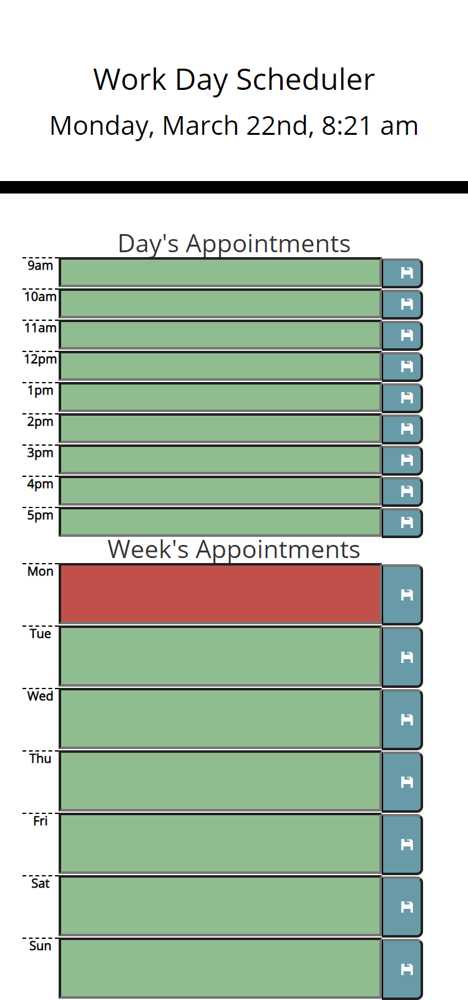

# work-day-planner

I have created a calander app using JQuery to dynamically update the HTML and CSS provided in the starter code.  This app can be used as a Daily work-day planner as shown below.  Upon loading, the current date is shown on the top of the page.  Each hour of the workday has a time-block in which to enter appointments and notes.  The color coding of these blocks shows which times are in the past, present, and future.  The page is reloaded on the hour to ensure the color scheme is updated.  Once text is entered and the Save icon is clicked, the appointments are stored into local storage where they will be saved and recovered when the page is reloaded.  If the text is deleted, clicking the save icon will replace the previous entry in local storage with am empty string.  The page is deployed at [kellyjohnson364.github.io/work-day-planner](https://kellyjohnson364.github.io/work-day-planner).  

